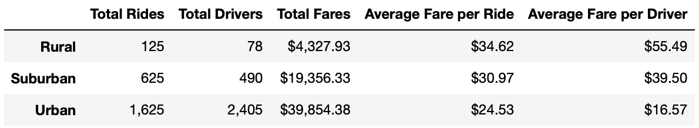

# Pyber_Analysis: A Visual Guide for Data
## Overview of the PyBer Data Analysis
- The purpose of this project was utilizing the Python and Pandas skills that I have learned to create a data summary over the analysis of ride-sharing data in different city types. The caveat to this data analysis however was the inclusion of a visual depiction of what the data told. The task of creating a visual representation of our data analysis would be achieved by using Python, Pandas, and Matplotlib to create a multiple-line graph that would showcase our results of the ride sharing data to our partner Omar and higher management people such as V.Isualize.  

## Results
 
