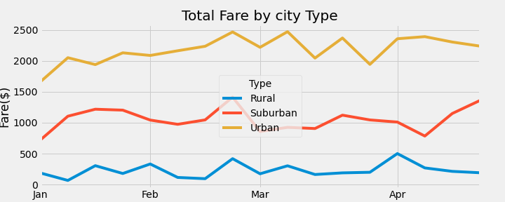

# Pyber_Analysis: A Visual Guide for Data
## Overview of the PyBer Data Analysis
- The purpose of this project was utilizing the Python and Pandas skills that I have learned to create a data summary over the analysis of ride-sharing data in different city types. The caveat to this data analysis however was the inclusion of a visual depiction of what the data told. The task of creating a visual representation of our data analysis would be achieved by using Python, Pandas, and Matplotlib to create a multiple-line graph that would showcase our results of the ride sharing data to our partner Omar and higher management people such as V.Isualize. The ride sharing data was based on three different city types, during the year 2019, from people that used the ride sharing app in the city types of: rural, suburban, and urban.

## Results
### PyBer Summary Dataframe Image
 
- The image above is the PyBer ride share data analysis summary dataframe. This image provides a summary of our data that was specifically processed, collected, and formatted by Python coding and Pandas data framing. From the data summary dataframe, the ride sharing data can be examined in various parts based on the formatted columns of: total rides, total, drivers, total fares, average fare per ride, and total fare by city type. As previously mentioned, the data of the ride sharing app are from the three different city types, here are the differences:

  - **Total Rides**
      - From the total rides column of the Ride Sharing Data summary dataframe, we are able to see that each city type had varying numbers of people calling for rides. The city with the most people using the ride sharing app was the city type "Urban" with 1625 rides. Coming in second with the most rides was the "Suburban" city type with 625 total rides. The city type "Rural" came in last with only 125 total rides. 
 
  - **Total Drivers**
      - From the total drivers column of the Ride Sharing Data summary dataframe, we are able to see that each city type had different numbers of drivers working for the app to provide rides. The city with the most drivers available to provide rides was the "Urban" city type with 2405 drivers. The "Suburban" city type came in second with 490 drivers, and in third was the "Rural" city type with 78 drivers. 
      
  - **Total Fares**
      - From the total fares column of the Ride Sharing Data summary dataframe, we are able to see the total amount of fare(or money) each city type had made. The "Urban" city type came out with the highest fare collected at about $39,854.38. The "Suburban" city type collected a total fare of about $19,356.33, and the lowest total fare collected the "Rural" city type with about $4,327.93. 
      
  - **Average Fare Per Ride**
      - From the average fare per ride column of the Ride Sharing Data summary dataframe, we are able to see the average cost per ride of each city type. The most expensive ride fare came from the "Rural" city data type, as the average fare per ride was about $34.62. The second highest ride fare came from the "Suburban" city data type, as the average fare per ride was about $30.97. The "Urban" city data type had the cheapest fare as the average fare per ride was $24.53. 
  
  - **Average Fare Per Driver**
      - From the average fare per driver column of the Ride Sharing Data summary dataframe, we are able to see the average fare each driver by city type charged. The highest fare per driver went to the "Rural" city type at about $55.49. The second highest fare per driver belonged to the "Suburban" city type at about $39.50. In third with the lowest fare per driver was the "Urban" city type as the average fare was about $16.57. 

## Summary of the PyBer Analysis: 3 Business Recommendations
  - Based on our results from the PyBer Ride Sharing data analysis, here are three business recommendations that could be used by upper management to address disparities in the data, based among the city types.
  
      1. Expanding the range of the datae/time frame in order to collect more data for analysis. The current data examined only accounted for the year 2019. Looking further down the date/time frame will allow for more data to be analyzed and ensure no anomalies occur. 
      
      2. Calculating the average money lossed from app users cancelling car rides due to there not being enough drivers to pick up riders. Identifying the losses each city type accrues can provide important feedback for adjustments that can   improve profit and app-user convenience. 
      
      3. Addressing low numbers of app users in rural and suburban city types by adjusting average fare per ride prices to make it more affordable and incentivize app users to use the app for transportation. More marketing and ad campaigns in these low profit grossing city types will hopefully lead to an uptake in ride sharing app usage.
  
  - Below is the multiple-line chart demonstrating our PyBer Data Analysis for "Total Fare by City Type"
  
     
